# 🛒 ShopEasy: Enterprise-Grade DevOps & Cloud Project

A comprehensive, production-ready e-commerce infrastructure deployment featuring a **React Frontend**, **Spring Boot Backend**, and **MySQL RDS**, orchestrated with **Jenkins**, **Docker**, **AWS ALB/ASG**, and **CloudFront**.

---

## 🏗️ Architecture & Data Flow

This project implements a highly available, scalable, and secure architecture:

```text
[ User ] 
   ↓ (HTTPS)
[ AWS CloudFront (CDN) ] ----------------→ [ Amazon S3 ] (Static Frontend Assets)
   ↓ (API Requests: /products, /health)
[ Application Load Balancer (ALB) ]
   ↓ (Port 8080)
[ Auto Scaling Group (ASG) ] 
   ↳ [ EC2 Instances (Docker Containers) ]
       ↓ (JDBC)
[ Amazon RDS (MySQL) ]
```

### **Deployment Flow (CI/CD)**
1. **Developer** pushes code to **GitHub**.
2. **Jenkins** triggers a multi-stage pipeline:
   - **Frontend**: Build (npm) → Sync to **S3** → Invalidate **CloudFront**.
   - **Backend**: Build (Maven) → Build **Docker Image** → Push to **ECR** → Trigger **ASG Instance Refresh**.
3. **AWS CloudWatch** monitors metrics and logs, sending alerts via **SNS**.

---

## 📸 Proof of Work (AWS Infrastructure)

Below are the visual proofs of the implemented services and successful deployment.

### **1. Frontend & CDN**
| Service | Evidence |
| :--- | :--- |
| **Live Website** | 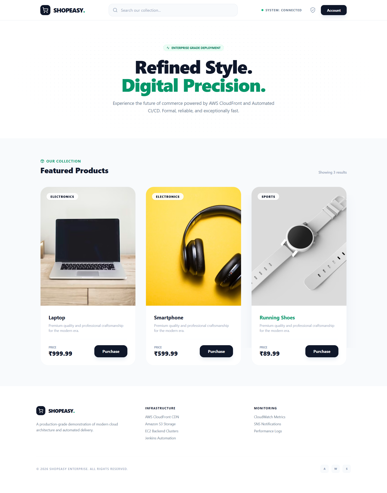 |
| **CloudFront Distribution** | 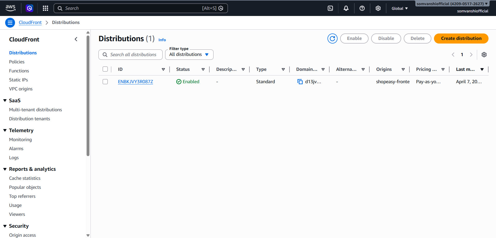 |
| **S3 Bucket (Static Hosting)** | 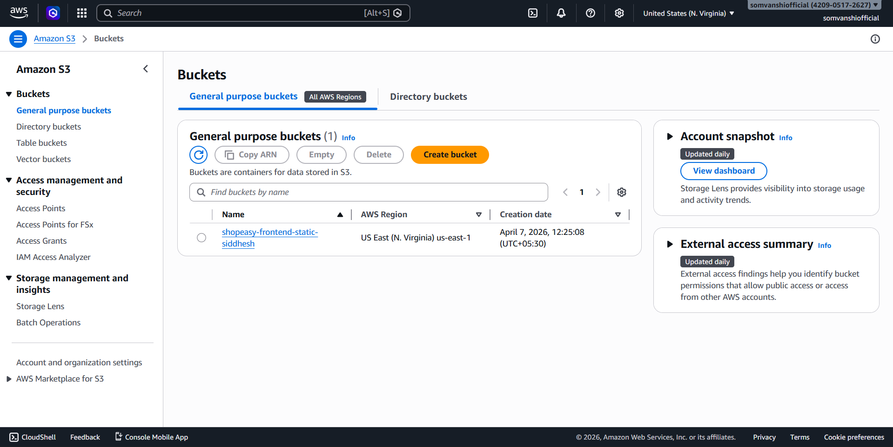 |

### **2. Backend & Scalability**
| Service | Evidence |
| :--- | :--- |
| **Load Balancer (ALB)** | 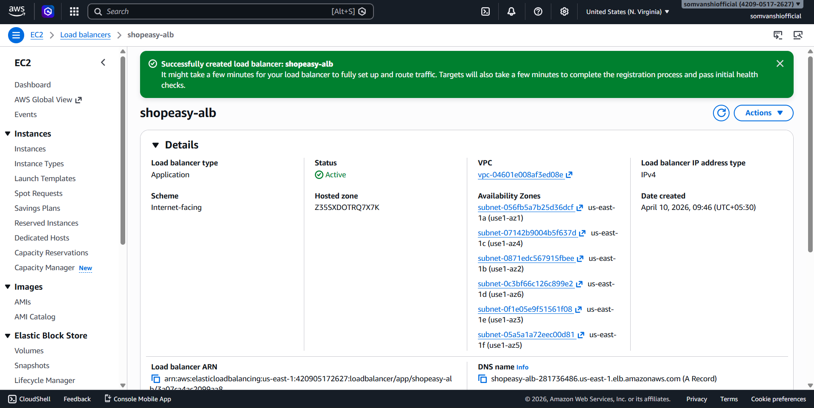 |
| **Target Group** | 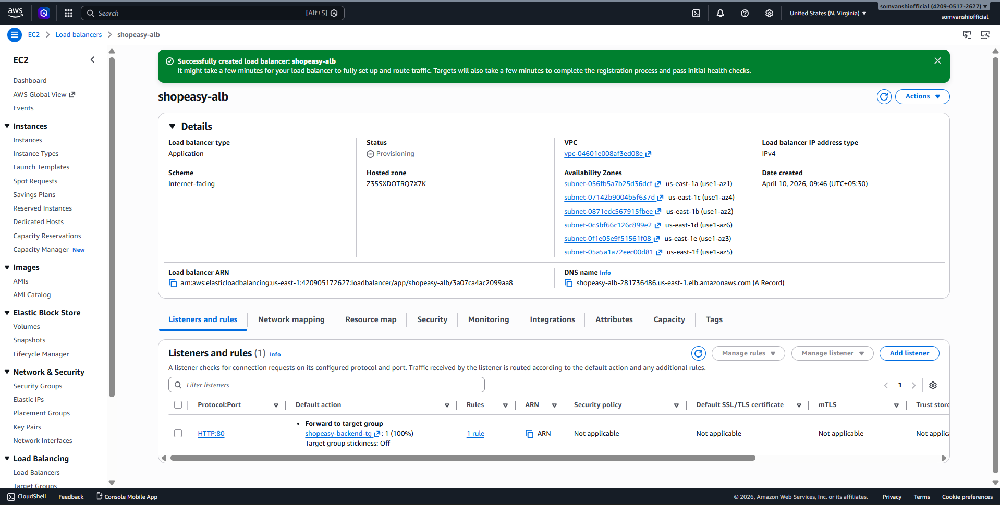 |
| **Auto Scaling Group** | 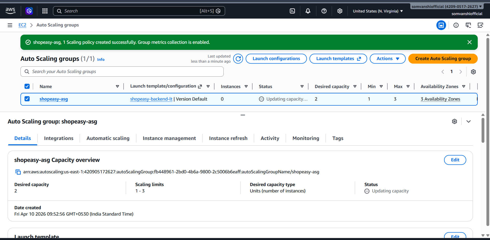 |
| **Launch Template** |  |
| **EC2 Instances** | 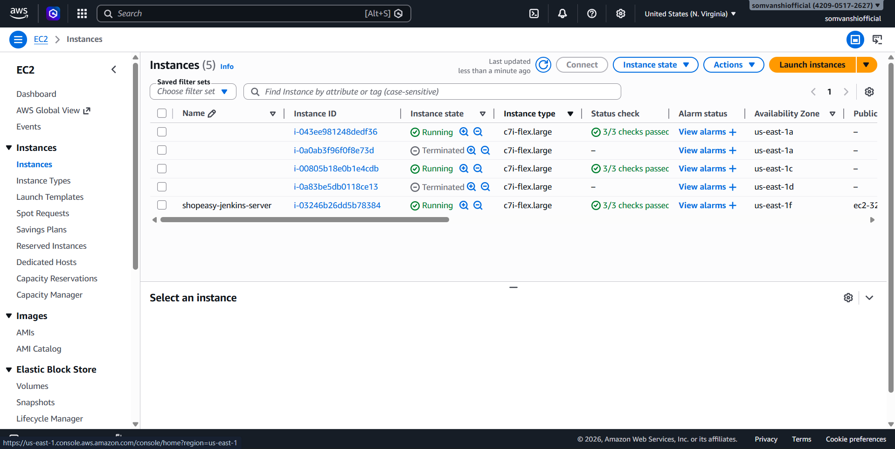 |

### **3. Database & Registry**
| Service | Evidence |
| :--- | :--- |
| **Amazon RDS (MySQL)** | 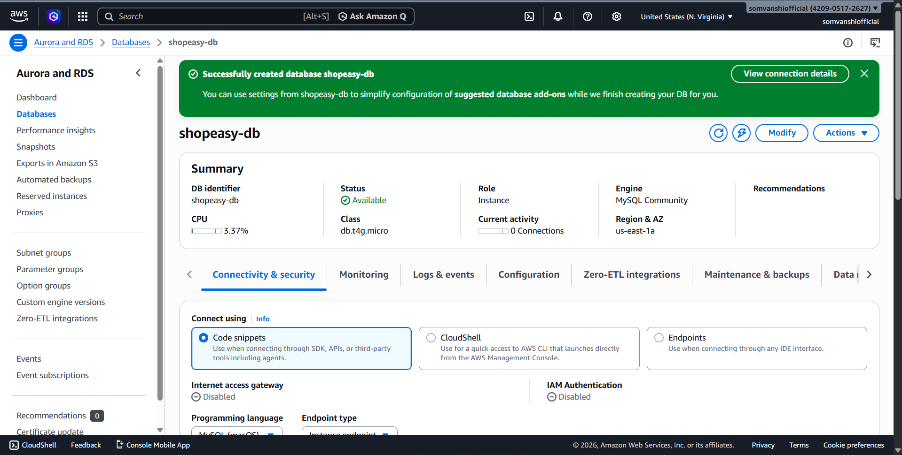 |
| **Amazon ECR** | 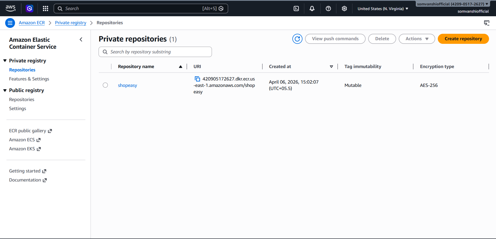 |

### **4. CI/CD & Automation**
| Service | Evidence |
| :--- | :--- |
| **Jenkins Pipeline** | 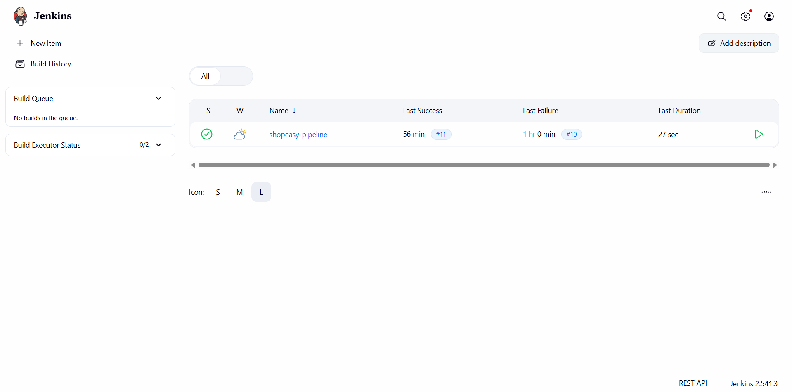 |
| **IAM Roles & Permissions** | 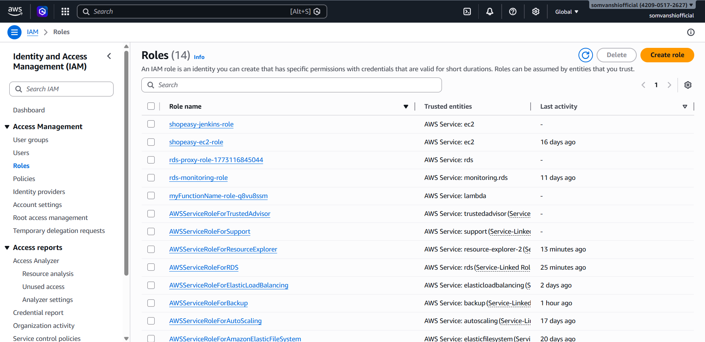 |
| **Security Groups** | 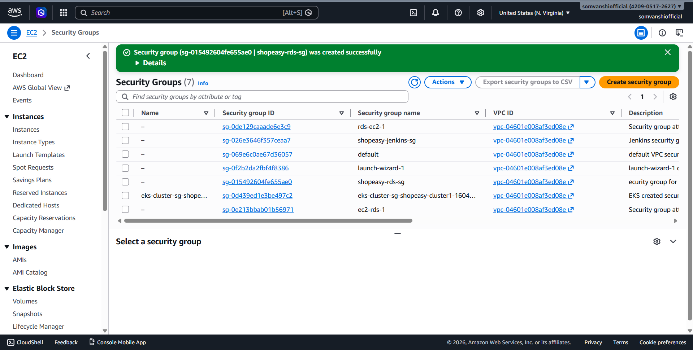 |

### **5. Monitoring & Alerts**
| Service | Evidence |
| :--- | :--- |
| **CloudWatch Dashboard** | 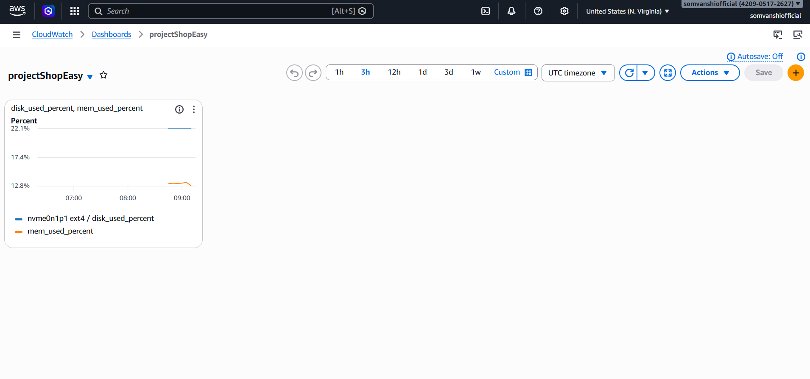 |
| **CloudWatch Alarms** | 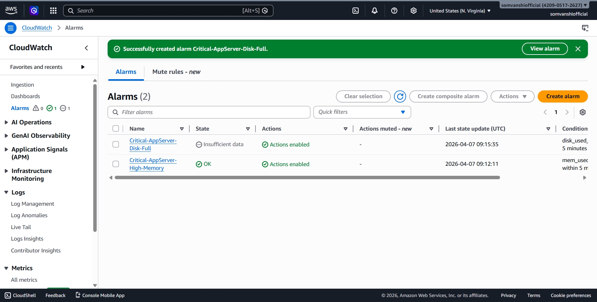 |
| **SNS Notifications** | 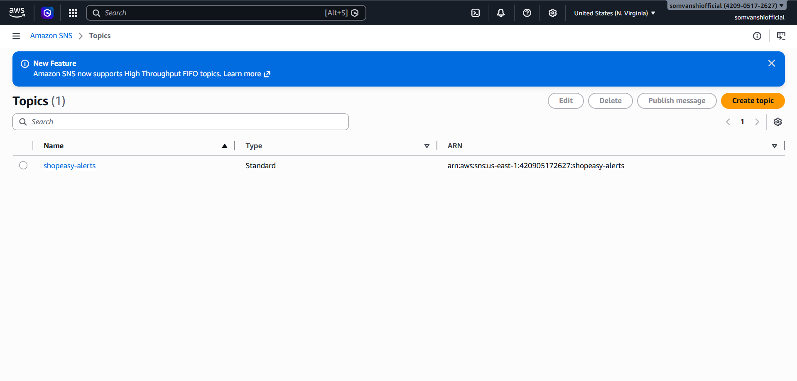 |

---

## 🛠️ Prerequisites

- **AWS Account**: Free Tier eligible.
- **GitHub Account**: To host your repository.
- **Local Machine Tools**:
  - [Git](https://git-scm.com/)
  - [AWS CLI](https://aws.amazon.com/cli/) (configured with `aws configure`)
  - [Node.js & npm](https://nodejs.org/) (for Frontend)
  - [Java 21 & Maven](https://maven.apache.org/) (for Backend)
  - [Docker](https://www.docker.com/)

---

## 🚀 Step-by-Step Setup Guide

### 1. Database Setup (Amazon RDS)
1. **Create Database**: Select **MySQL** -> **Free Tier**.
2. **Settings**: DB Instance ID: `shopeasy-db`, Master Username: `admin`, Password: `shopeasy_password_123`.
3. **Connectivity**: 
   - Public access: **Yes** (for initial setup).
   - Security Group: Create new, allow **Port 3306** from your IP and the Backend Security Group.
4. **Initialize Data**: Connect to RDS using MySQL Workbench or CLI and create the database:
   ```sql
   CREATE DATABASE shopeasy;
   ```

### 2. Backend Infrastructure (ECR, ALB, ASG)
1. **ECR**: Create a repository named `shopeasy`. Note the URI.
2. **ALB**:
   - Create a **Target Group** (Instances, Port 8080, Health Check: `/health`).
   - Create an **Application Load Balancer** (Internet-facing, Listeners: Port 80 -> Target Group).
3. **Launch Template**: 
   - Create a template using **Ubuntu 24.04**.
   - **User Data**: Use the script in the project docs to auto-install Docker and run the app.
4. **ASG**: Create an Auto Scaling Group using the Launch Template, attached to the ALB.

### 3. Frontend Hosting (S3 & CloudFront)
1. **S3**: Create a bucket `shopeasy-frontend-static-unique-id`.
2. **CloudFront**:
   - Origin: S3 Bucket.
   - **OAC**: Restrict S3 access to CloudFront only.
   - **Behaviors**: 
     - Default (*): S3.
     - `/products` & `/health`: ALB DNS.
   - **Default Root Object**: `index.html`.

### 4. Code Customization
Update these files with your specific IDs and endpoints:

| File Path | Key to Update |
| :--- | :--- |
| [Jenkinsfile](file:///jenkins/Jenkinsfile) | `AWS_ACCOUNT_ID`, `S3_BUCKET`, `DISTRIBUTION_ID`, `ASG_NAME` |
| [App.js](file:///frontend/src/App.js) | `BACKEND_URL` (Ensure it uses `window.location.origin`) |
| [application.properties](file:///app/src/main/resources/application.properties) | `spring.datasource.url` (RDS Endpoint) |

---

## 🏗️ Local Development

### **Run Backend Locally**
```bash
cd app
mvn clean package
java -jar target/shopeasy-0.0.1-SNAPSHOT.jar \
  --spring.datasource.url=jdbc:mysql://YOUR_RDS_ENDPOINT:3306/shopeasy \
  --spring.datasource.username=admin \
  --spring.datasource.password=shopeasy_password_123
```

### **Run Frontend Locally**
```bash
cd frontend
npm install
npm start
```
*Note: For local testing, you may need to temporarily hardcode the `BACKEND_URL` to `http://localhost:8080`.*

---

## 🎡 CI/CD Pipeline (Jenkins)

1. **Setup Jenkins**: Install on an EC2 instance or run via Docker.
2. **Plugins**: Install `Pipeline`, `AWS Steps`, `Docker Pipeline`, `Maven Integration`.
3. **Credentials**:
   - `aws-creds`: AWS IAM User keys (with S3, ECR, CloudFront, ASG permissions).
4. **Create Job**: New Item -> Multibranch Pipeline -> Add Source (GitHub).

---

## 📈 Monitoring & Quality

### **CloudWatch Monitoring**
- **Agent**: Installed on ASG instances via Launch Template.
- **Alarms**: High CPU, Memory Usage, and 5XX Errors on ALB.
- **Logs**: Backend logs streamed to CloudWatch Log Groups.

### **SonarQube (Code Quality)**
To run a manual scan:
```bash
mvn sonar:sonar \
  -Dsonar.projectKey=shopeasy \
  -Dsonar.host.url=http://your-sonarqube-server:9000 \
  -Dsonar.login=your-token
```

---

## ☸️ Kubernetes (Optional)
To deploy on **EKS**, use the provided manifests:
```bash
kubectl apply -f k8s/base/deployment.yaml
kubectl apply -f k8s/base/service.yaml
```

---

## 👤 Author
**Siddhesh Somvanshi**  
*DevOps & Cloud Engineer*

---
*Disclaimer: This is a professional portfolio project. Monitor your AWS usage to stay within the Free Tier.*
